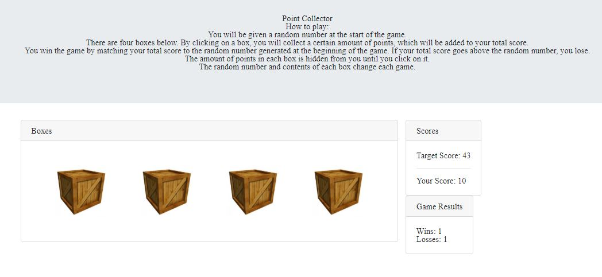

# Unit-4-Game: Point Collector

## Summary
This is my point collector game created using javascript and jquery. This browser creates a random number which acts as a target score for the user. The user can attempt to reach this score using four buttons, each containing a random number of points, which change each game. The browser then tracks the number of user wins and losses. 

## Site Pictures


## Technologies Used 
- HTML - Used to create elements on the DOM
- JS - Used to manipulate content on HTML
- JQuery - JavaScript library used for DOM manipulation
- Git - Version control system to track changes to source code
- Github - Hosts repository that can be deployed to GitHub pages

## Code Snippet
The following code shows the jquery on click function used to add the value associated with the button clicked to the user score. The score is then compared to the target score.
```js
$("#button-1").on("click", function() {

        totalScore = totalScore + value1;

        if (totalScore < computerNumber) {
            totalScore = totalScore;
            $("#your-score").html("Your Score: " + totalScore);       
        };

        if (totalScore > computerNumber) {
            $("#your-score").html("Your Score: " + totalScore);
            losses++
            $("losses").html("Losses: " + losses);
            alert("Try again!")
            computerNumber = "";
            totalScore = 0;
            value1 = 0;
            reset();
        }

        if (totalScore === computerNumber) {
            $("#total-score").html("Your Score: " + totalScore);
            wins++
            $("#wins").html("Wins: " + wins);
            alert("Winner! Play again!")
            computerNumber = "";
            totalScore = 0;
            reset();
        }

    })
```

## Author Links
https://github.com/hagoodj